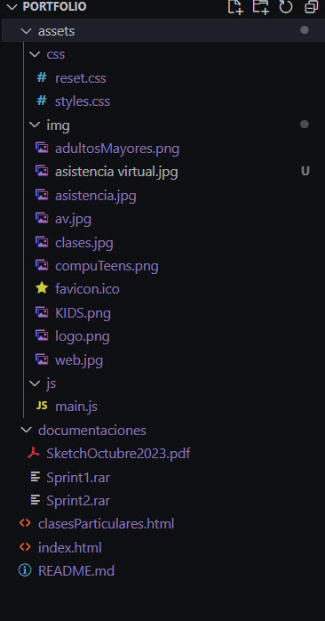

# Portfolio de Alejandra Duarte

Este es el repositorio de mi proyecto de Portfolio, diseñado para mostrar mis servicios y habilidades en asistencia virtual, clases de computación y diseño web, realizado en el curso de BA Multiplica 2.0 desde el 12 de Septiembre 2023 al 23 de Noviembre 2023.

## Contenido

- [Estructura del Proyecto](#estructura-del-proyecto)
- [Descripción](#descripción)
- [Funcionalidades](#funcionalidades)
- [Capturas de Pantalla](#capturas-de-pantalla)
- [Cómo Utilizar](#cómo-utilizar)
- [Tecnologías Utilizadas](#tecnologías-utilizadas)
- [Autora](#autora)
- [Documentación](#documentación)
- [Contacto](#contacto)

## Estructura del Proyecto

El proyecto está organizado de la siguiente manera:

## Descripción

Este proyecto es un portfolio personal desarrollado por Alejandra Duarte. Tiene como objetivo principal presentar los servicios ofrecidos y proporcionar información de contacto para potenciales clientes.

## Funcionalidades

- **Sección "Soy yo"**: Describe quién es Alejandra Duarte.
- **Sección "Servicios"**: Muestra los servicios ofrecidos con un dropdown.
- **Sección "Servicios" en el main del index**: Muestra resúmenes de los servicios ofrecidos.
- **Sección "Contacto"**: Proporciona datos de contacto y un formulario.
- **Footer**: Contiene accesos rápidos y enlaces a las redes sociales de Alejandra.

## Capturas de Pantalla

Inserta aquí capturas de pantalla significativas de tu proyecto.

## Cómo Utilizar

1. Clona este repositorio: `git clone https://github.com/duarteale/Portfolio.git`
2. Abre el archivo `index.html` en tu navegador web.

## Tecnologías Utilizadas

- HTML
- CSS
- JavaScript

## Autora

Alejandra Duarte (GitHub: [duarteale](https://github.com/duarteale))

## Documentación

La documentación del proyecto se encuentra en la carpeta `documentaciones`.
Donde se encuentra disponible para su [Descargar PDF](./documentaciones/SketchOctubre2023.pdf) el Sketch realizado en el Primer Sprint.
Tambien se encuentran los archivos .rar del [Sprint 1](./documentaciones/Sprint1.rar)  y del [Sprint 2](./documentaciones/Sprint2.rar).

## Contacto

Para cualquier consulta o colaboración, puedes contactar a Alejandra Duarte a través de:

- Email: [almavirtualbolivar@gmail.com](mailto:almavirtualbolivar@gmail.com)
- LinkedIn: [Alejandra Duarte en LinkedIn](https://www.linkedin.com/in/duarteale)
- Instagram: [@almavirtualbolivar](https://www.instagram.com/almavirtualbolivar)
- GitHub: [duarteale en GitHub](https://github.com/duarteale)

Probando imagenes
